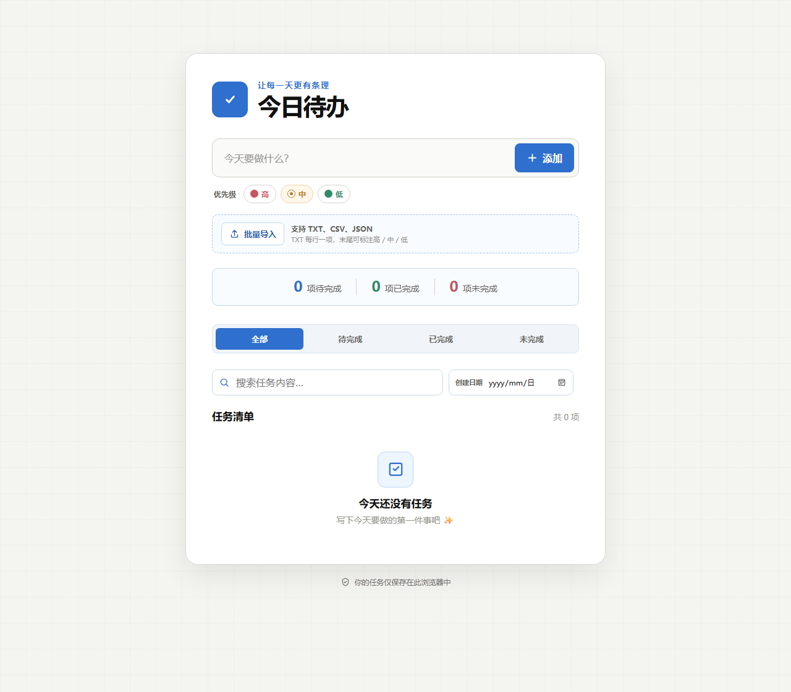
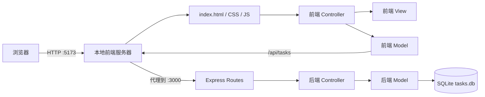

# Agenda Application · 今日待办

> 一个开箱即用的本地全栈待办事项应用：原生 JavaScript 前端、Express REST API、SQLite 持久化，以及清晰的前后端 MVC 分层。

无需安装数据库服务，也不需要注册账号。Clone、安装、启动，几分钟内就能拥有一套完整可读、可改、可学习的本地全栈示例。



## 为什么做这个项目

很多待办事项示例停留在浏览器 `localStorage`：页面能够交互，却没有真正的后端、数据库和接口层。Agenda Application 在保持轻量的同时补齐了一条完整的数据链路：

```text
浏览器界面 → 前端 Controller → 前端 Model → REST API → 后端 Controller → SQLite
```

它既可以作为日常可用的本地任务清单，也适合用来学习：

- 如何把纯静态页面渐进改造成前后端分离项目；
- 如何用 MVC 组织前端和后端职责；
- 如何设计简单、可运行的 REST API；
- 如何让 SQLite 在项目目录内自动初始化并持久化数据；
- 如何用 npm workspaces 管理一个小型全栈仓库。

## 功能亮点

- **完整任务管理**：添加、编辑、完成、删除、清空已完成、全部清空。
- **三级优先级**：高、中、低使用不同颜色快速区分。
- **三种任务状态**：待完成、已完成、超时未完成。
- **快速查找**：支持任务内容模糊搜索、创建日期筛选和状态分类。
- **灵活计时**：每项任务可单独设置截止时间或预计完成时长。
- **在线提醒**：倒计时剩余十分钟时显示站内弹窗；到期仍未完成时自动标记为未完成。
- **批量导入**：支持 TXT、CSV、JSON，未提供优先级时默认使用中优先级。
- **拖曳排序**：直接拖动任务调整顺序，排序结果写入数据库。
- **本地持久化**：数据保存在 SQLite 中，刷新页面或重启服务不会丢失。
- **响应式界面**：桌面和手机浏览器均可使用。

## 快速开始

### 环境要求

- [Node.js](https://nodejs.org/) `22.12` 或更高版本
- npm `10` 或更高版本
- Git

> 不需要单独下载 SQLite。`better-sqlite3` 会随 npm 依赖安装，数据库文件会在第一次启动时自动创建。

### 1. Clone 仓库

```powershell
git clone https://github.com/IThuanghuaming/Agenda-Application.git
cd Agenda-Application
```

### 2. 安装依赖

```powershell
npm install
```

依赖安装在项目内的 `node_modules/`，npm 下载缓存保存在项目内的 `.npm-cache/`。

### 3. 启动完整项目

```powershell
npm run dev
```

正常启动后，你会看到类似输出：

```text
API: http://localhost:3000
SQLite: ...\Agenda-Application\server\data\tasks.db
Web: http://localhost:5173
```

打开浏览器访问：

- 应用页面：<http://localhost:5173>
- 后端健康检查：<http://localhost:3000/api/health>

在终端按 `Ctrl + C` 可以停止服务。

> **请在项目根目录执行 `npm run dev`。** 如果只进入 `client` 目录启动 Vite，页面虽然能够打开，但保存任务时会因为后端没有运行而失败。

## 技术栈

| 层级 | 技术 | 用途 |
| --- | --- | --- |
| 前端 | HTML5、CSS3、原生 JavaScript | 页面结构、响应式样式和交互 |
| 前端构建 | Vite 7 | 开发服务器与生产构建 |
| 后端 | Node.js、Express 5 | REST API、请求校验和路由 |
| 数据库 | SQLite | 零配置、单文件数据持久化 |
| SQLite 驱动 | better-sqlite3 | Node.js 同步数据库访问和事务 |
| 项目管理 | npm workspaces | 统一管理 `client` 与 `server` |
| 架构 | MVC | 分离数据、界面和交互职责 |

## 系统架构



根目录的 `scripts/dev.js` 会在同一个 Node.js 进程内启动两个端口：

- `5173` 提供前端文件，并把 `/api/*` 转发到后端；
- `3000` 运行 Express API；
- 浏览器始终通过 `/api` 相对地址访问后端，不需要硬编码环境地址。

## 项目结构

```text
Agenda-Application/
├─ client/                              # 前端工程
│  ├─ index.html                        # 页面结构和HTML模板
│  ├─ package.json
│  ├─ vite.config.js
│  └─ src/
│     ├─ models/taskModel.js            # Fetch请求和API错误处理
│     ├─ views/taskView.js              # DOM查询与任务列表渲染
│     ├─ controllers/taskController.js  # 交互、筛选、导入、计时、排序
│     └─ styles/main.css                # 响应式界面样式
├─ server/                              # 后端工程
│  ├─ data/
│  │  └─ tasks.db                       # 运行时生成，不提交Git
│  ├─ package.json
│  └─ src/
│     ├─ config/database.js             # SQLite连接和初始化
│     ├─ database/schema.sql            # 表结构与索引
│     ├─ models/taskModel.js            # SQL查询、映射和事务
│     ├─ controllers/taskController.js  # 参数校验与HTTP响应
│     ├─ routes/taskRoutes.js           # REST路由
│     ├─ middleware/errorHandler.js      # 统一异常响应
│     ├─ app.js                         # Express应用配置
│     └─ server.js                      # 独立后端启动入口
├─ scripts/dev.js                       # 一条命令启动完整项目
├─ preview.png                          # README预览图
├─ .npmrc                               # 项目内npm缓存配置
├─ .gitignore
├─ package.json                         # npm workspaces和根命令
├─ package-lock.json
└─ README.md
```

## MVC 如何分工

### 前端 MVC

- **Model — `client/src/models/taskModel.js`**
  负责 `fetch` 请求、解析响应以及向页面返回可理解的错误。当前提供读取全部任务和保存完整任务清单的方法。

- **View — `client/src/views/taskView.js`**
  负责查询DOM、克隆任务模板、设置状态和优先级样式，并把任务数据显示到页面。

- **Controller — `client/src/controllers/taskController.js`**
  负责监听用户操作，维护当前任务数组，处理搜索、筛选、文件解析、拖曳和倒计时，并协调 Model 与 View。

### 后端 MVC

- **Routes — `server/src/routes/taskRoutes.js`**
  定义URL和HTTP方法，把请求交给对应Controller。

- **Controller — `server/src/controllers/taskController.js`**
  校验任务内容、状态、优先级和时间设置，返回合适的JSON和状态码。

- **Model — `server/src/models/taskModel.js`**
  唯一直接执行SQL的业务层，负责CRUD、排序、批量保存、过期状态更新和数据库对象映射。

## 一次任务保存经历了什么

以勾选“已完成”为例：

1. 前端 Controller 收到复选框事件；
2. 修改内存中对应任务的 `status`；
3. 调用 View 立即刷新页面；
4. 前端 Model 发送 `PUT /api/tasks`；
5. Express Route 把请求交给后端 Controller；
6. Controller 校验任务数组；
7. 后端 Model 在一个 SQLite 事务中保存任务和排序；
8. API 返回保存后的任务列表。

当前采用“保存完整任务数组”的方式，这是为了让本地单用户MVP保持简单，并自然保存拖曳顺序。它不适合多人并发编辑；如果以后扩展为多用户系统，应改为逐项使用POST、PATCH和DELETE。

## REST API

基础路径：`http://localhost:3000/api`

| 方法 | 路径 | 说明 |
| --- | --- | --- |
| `GET` | `/health` | 后端健康检查 |
| `GET` | `/tasks` | 查询任务，可使用状态、关键词和日期参数 |
| `POST` | `/tasks` | 创建单个任务 |
| `PUT` | `/tasks` | 用完整任务数组保存当前清单 |
| `PATCH` | `/tasks/:id` | 修改指定任务 |
| `DELETE` | `/tasks/:id` | 删除指定任务 |
| `POST` | `/tasks/import` | 批量导入任务 |
| `POST` | `/tasks/reorder` | 保存任务ID顺序 |
| `DELETE` | `/tasks/completed` | 删除所有已完成任务 |
| `DELETE` | `/tasks/all` | 删除所有任务 |

### 查询示例

```http
GET /api/tasks?status=pending&q=会议&createdDate=2026-07-31
```

支持的状态：

- `pending`：待完成
- `completed`：已完成
- `failed`：倒计时结束时仍未完成

### 创建任务示例

```http
POST /api/tasks
Content-Type: application/json

{
  "text": "整理项目README",
  "priority": "high"
}
```

### 保存完整清单示例

```http
PUT /api/tasks
Content-Type: application/json

{
  "tasks": [
    {
      "id": "550e8400-e29b-41d4-a716-446655440000",
      "text": "验证SQLite持久化",
      "priority": "medium",
      "status": "pending",
      "timing": null,
      "createdAt": 1785427200000
    }
  ]
}
```

任务内容不能为空且最长为200个字符；非法状态、优先级或计时配置会返回`400`。

## SQLite 数据

数据库在首次运行时自动创建：

```text
server/data/tasks.db
```

主要字段：

| 字段 | 说明 |
| --- | --- |
| `id` | 任务唯一ID |
| `text` | 任务内容 |
| `status` | `pending` / `completed` / `failed` |
| `priority` | `high` / `medium` / `low` |
| `timing_mode` | `deadline`或`duration` |
| `configured_deadline` | 用户设置的截止时间 |
| `duration_minutes` | 预计用时，单位为分钟 |
| `started_at` | 倒计时开始时间戳 |
| `end_at` | 倒计时结束时间戳 |
| `reminder_shown` | 十分钟提醒是否已经显示 |
| `created_at` | 创建时间戳 |
| `updated_at` | 最近更新时间戳 |
| `sort_order` | 拖曳排序位置 |

SQLite使用WAL模式，因此运行时可能同时看到：

```text
tasks.db
tasks.db-wal
tasks.db-shm
```

这是正常现象，这三个文件都已加入`.gitignore`。

## 批量导入格式

### TXT

每行一项任务，行末可以写高、中、低；没有标注时默认为中优先级。

```text
准备周会材料 高
整理本月发票 中
阅读行业报告 低
没有标注的普通任务
```

也支持括号写法：

```text
修复接口问题（高）
编写使用说明（中）
整理资料（低）
```

### CSV

```csv
任务,优先级
准备演示材料,高
回复客户邮件,中
整理下载目录,低
```

支持的任务表头包括`任务`、`任务内容`、`待办事项`、`text`、`task`和`content`。

### JSON

字符串数组：

```json
[
  "检查API",
  "更新README"
]
```

任务对象数组：

```json
[
  { "text": "检查API", "priority": "high" },
  { "task": "更新README", "priority": "medium" },
  { "任务内容": "整理截图", "优先级": "低" }
]
```

无效或缺少任务内容的记录会被跳过，导入结果会显示成功和跳过数量。

## 截止时间、倒计时和提醒

任务创建后，可以在任务卡片中选择：

- **指定时间**：设置一个未来的具体截止时间；
- **所需时长**：设置完成任务预计需要的分钟数。

保存时间并点击“开始”后，页面每秒更新倒计时：

- 剩余十分钟时显示站内提醒；
- 倒计时结束仍未勾选完成时，状态自动变成`failed`；
- 网页关闭后不会弹出系统通知；
- 再次打开页面时，后端会在读取任务时修正已经过期的状态。

## 开发命令

在项目根目录执行：

```powershell
# 安装所有workspace依赖
npm install

# 同时启动前端和后端
npm run dev

# 构建前端，输出到client/dist
npm run build

# 只启动Express后端
npm run start:server
```

如果你确实需要单独运行Vite，请同时在另一个终端启动后端：

```powershell
# 终端1：项目根目录
npm run start:server

# 终端2：项目根目录
npm run dev --workspace=client
```

## 常见问题

### 保存失败，终端出现`ECONNREFUSED`

典型日志：

```text
[vite] http proxy error: /api/tasks
AggregateError [ECONNREFUSED]
```

这表示只启动了前端，`localhost:3000`上没有后端服务。

解决方法：

```powershell
# 停止当前Vite：Ctrl+C
cd D:\CodexProject\Agenda-Application
npm run dev
```

确认终端同时显示`API: http://localhost:3000`和`Web: http://localhost:5173`。

### 端口3000或5173被占用

先停止其他正在运行的项目终端，再重新运行`npm run dev`。如果任务管理器里存在旧Node.js进程，确认它属于本项目后再结束。

### 删除`node_modules`后项目不能运行

依赖可以重新生成：

```powershell
npm install
npm run dev
```

### 删除`tasks.db`会怎样

`server/data/tasks.db`包含你的任务数据。删除后，下次启动会生成一个空数据库，原任务无法自动恢复。

## 数据与隐私

这是本地应用：

- 任务不会自动上传到云端；
- 数据保存在当前项目的`server/data/tasks.db`；
- npm依赖保存在`node_modules/`；
- npm缓存保存在`.npm-cache/`；
- 前端构建产物保存在`client/dist/`；
- 数据库、缓存、依赖和构建产物均不会提交到GitHub。

删除整个项目目录也会删除数据库。重要任务请自行备份`tasks.db`。

## 当前限制

- 没有账号、登录和不同用户的数据隔离；
- 连接到同一本地服务的浏览器共享同一个数据库；
- 网页关闭后不会发送提醒；
- 当前整表保存策略面向单用户，不适合多人同时编辑；
- 没有云端同步和跨设备同步；
- 当前没有自动化CI和发布流程。

这些限制是有意保留的：项目目标是提供一个容易阅读、容易运行、容易继续扩展的本地全栈MVP。

## 参与贡献

欢迎通过Issue或Pull Request改进项目。建议流程：

1. Fork本仓库；
2. 创建功能分支：`git switch -c feature/your-feature`；
3. 保持修改聚焦，并同步更新相关README内容；
4. 执行`npm run build`；
5. 提交Pull Request，说明改动目的、行为变化和验证方式。

适合继续探索的方向包括：

- 为前端改用逐项REST操作，减少整表写入；
- 增加自动化测试；
- 增加数据导出和备份；
- 增加可选的桌面通知；
- 在不破坏本地MVP的前提下增加可选用户系统。

## License

当前仓库尚未添加`LICENSE`文件。在许可证明确之前，源代码默认仍受版权保护；公开可见不等于获得复制、修改或分发授权。

如果项目计划开放复用，建议仓库维护者后续选择并添加合适的开源许可证，例如MIT。

---

如果这个项目帮助你理解了从纯前端到Express + SQLite全栈应用的演进过程，欢迎Star或提出改进建议。