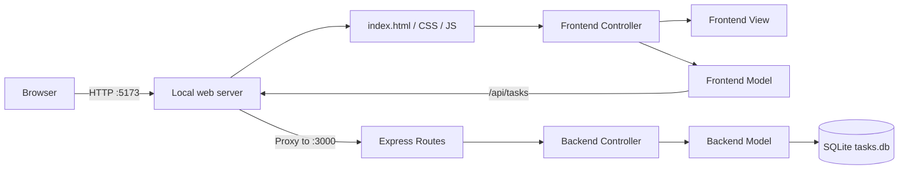

# Agenda Application · Today Todo

**Documentation language / 文档语言:** [简体中文](./README.md) | [English](./README_EN.md)

> A ready-to-run local full-stack todo application built with a vanilla JavaScript frontend, an Express REST API, SQLite persistence, and clear MVC separation on both sides.

[](#version-and-release-information)
[](./LICENSE)

No database server and no account registration are required. Clone, install, and start the project to get a complete local full-stack example in minutes.


## Why This Project Exists

Many todo demos stop at browser `localStorage`: the interface works, but there is no real backend, database, or API boundary. Agenda Application keeps the setup lightweight while providing a complete data path:

```text
Browser UI → Frontend Controller → Frontend Model → REST API → Backend Controller → SQLite
```

You can use it as a practical local task list or as a learning project for:

- migrating a static page into a separated frontend/backend application;
- organizing frontend and backend responsibilities with MVC;
- designing a small but working REST API;
- initializing and persisting project-local SQLite data;
- managing a full-stack repository with npm workspaces.

## Version and Release Information

Current version: **v1.0.0**

| Version | Date | Status | Summary |
| --- | --- | --- | --- |
| `v1.0.0` | 2026-07-31 | Current | First public MVP with frontend/backend MVC, SQLite persistence, task management, filters, search, timers, reminders, batch import, and drag-and-drop ordering |

The source of truth for the project version is the `version` field in the root `package.json`. When formal GitHub Releases are published, downloadable versions and release notes will be available on the [Releases page](https://github.com/IThuanghuaming/Agenda-Application/releases).

> Documentation is available in Simplified Chinese and English. The application interface is currently primarily Simplified Chinese and does not yet include an in-app language switcher.

## Feature Highlights

- **Complete task management** — add, edit, complete, delete, clear completed tasks, or clear everything.
- **Three priority levels** — high, medium, and low use distinct visual colors.
- **Three task states** — pending, completed, and overdue/failed.
- **Fast discovery** — fuzzy content search, creation-date filtering, and status tabs.
- **Flexible timing** — assign either a fixed deadline or an estimated duration to each task.
- **In-page reminders** — show a reminder with ten minutes remaining and mark unfinished expired tasks as failed.
- **Batch import** — import TXT, CSV, or JSON; missing priority defaults to medium.
- **Drag-and-drop ordering** — reorder tasks directly and persist the new order.
- **SQLite persistence** — tasks survive page refreshes and server restarts.
- **Responsive design** — usable on desktop and mobile browsers.

## Quick Start

### Prerequisites

- [Node.js](https://nodejs.org/) `22.12` or newer
- npm `10` or newer
- Git

> You do not need to install SQLite separately. The `better-sqlite3` driver is installed by npm, and the database file is created automatically on first start.

### 1. Clone the repository

```powershell
git clone https://github.com/IThuanghuaming/Agenda-Application.git
cd Agenda-Application
```

### 2. Install dependencies

```powershell
npm install
```

Dependencies are stored in the project `node_modules/` directory. The npm download cache is also project-local at `.npm-cache/`.

### 3. Start the complete application

```powershell
npm run dev
```

A successful start prints output similar to:

```text
API: http://localhost:3000
SQLite: ...\Agenda-Application\server\data\tasks.db
Web: http://localhost:5173
```

Open:

- Application: <http://localhost:5173>
- Backend health check: <http://localhost:3000/api/health>

Press `Ctrl + C` in the terminal to stop both servers.

> **Run `npm run dev` from the repository root.** Starting only Vite inside `client` opens the page without starting the API, so task saves will fail.

## Technology Stack

| Layer | Technology | Purpose |
| --- | --- | --- |
| Frontend | HTML5, CSS3, vanilla JavaScript | Structure, responsive styling, and interaction |
| Frontend tooling | Vite 7 | Development and production builds |
| Backend | Node.js, Express 5 | REST API, routing, and validation |
| Database | SQLite | Zero-configuration, single-file persistence |
| SQLite driver | better-sqlite3 | Synchronous Node.js access and transactions |
| Repository management | npm workspaces | Manage `client` and `server` together |
| Architecture | MVC | Separate data, presentation, and coordination responsibilities |

## System Architecture



The root `scripts/dev.js` starts two HTTP ports in one Node.js process:

- `5173` serves frontend source files and proxies `/api/*` requests;
- `3000` runs the Express API;
- the browser always uses relative `/api` URLs, so no environment-specific backend URL is hardcoded.

## Repository Layout

```text
Agenda-Application/
├─ client/                              # Frontend workspace
│  ├─ index.html                        # Page markup and HTML templates
│  ├─ package.json
│  ├─ vite.config.js
│  └─ src/
│     ├─ models/taskModel.js            # Fetch calls and API errors
│     ├─ views/taskView.js              # DOM lookup and rendering
│     ├─ controllers/taskController.js  # Events, filters, imports, timers, sorting
│     └─ styles/main.css                # Responsive styling
├─ server/                              # Backend workspace
│  ├─ data/
│  │  └─ tasks.db                       # Generated at runtime; ignored by Git
│  ├─ package.json
│  └─ src/
│     ├─ config/database.js             # SQLite connection and initialization
│     ├─ database/schema.sql            # Table and index definitions
│     ├─ models/taskModel.js            # SQL, mapping, and transactions
│     ├─ controllers/taskController.js  # Validation and HTTP responses
│     ├─ routes/taskRoutes.js           # REST routes
│     ├─ middleware/errorHandler.js      # Central error response
│     ├─ app.js                         # Express configuration
│     └─ server.js                      # Standalone API entrypoint
├─ scripts/dev.js                       # Start the complete local stack
├─ preview.png                          # README preview image
├─ .npmrc                               # Project-local npm cache
├─ .gitignore
├─ package.json                         # Workspaces and root commands
├─ package-lock.json
├─ LICENSE
├─ README.md                            # Simplified Chinese documentation
└─ README_EN.md                         # English documentation
```

## MVC Responsibilities

### Frontend MVC

- **Model — `client/src/models/taskModel.js`**

  Sends Fetch requests, parses API responses, and converts connection failures into useful user-facing errors. The current frontend reads all tasks and saves the complete ordered list.

- **View — `client/src/views/taskView.js`**

  Owns DOM lookup and task-item rendering, including status, priority, labels, and action buttons.

- **Controller — `client/src/controllers/taskController.js`**

  Handles user events, maintains the in-memory task list, parses imports, applies search and filters, manages drag ordering and timers, and coordinates Model and View.

### Backend MVC

- **Routes — `server/src/routes/taskRoutes.js`**

  Maps HTTP methods and URLs to controller operations.

- **Controller — `server/src/controllers/taskController.js`**

  Validates task text, state, priority, and timing configuration before returning JSON and appropriate status codes.

- **Model — `server/src/models/taskModel.js`**

  Is the only layer that executes SQL. It handles CRUD, ordering, batch persistence, expiration updates, row mapping, and SQLite transactions.

## How a Save Travels Through the System

When you mark a task as completed:

1. The frontend Controller receives the checkbox event.
2. It updates the task `status` in memory.
3. It asks the View to render the new state immediately.
4. The frontend Model sends `PUT /api/tasks`.
5. Express Routes pass the request to the backend Controller.
6. The Controller validates the task array.
7. The backend Model persists tasks and order inside a SQLite transaction.
8. The API returns the stored list.

The current full-list save strategy keeps this local, single-user MVP simple and preserves drag order naturally. It is not intended for concurrent multi-user editing; a future multi-user version should use per-task POST, PATCH, and DELETE calls.

## REST API

Base URL: `http://localhost:3000/api`

| Method | Path | Purpose |
| --- | --- | --- |
| `GET` | `/health` | Backend health check |
| `GET` | `/tasks` | Query tasks with optional state, keyword, and date filters |
| `POST` | `/tasks` | Create one task |
| `PUT` | `/tasks` | Replace the stored list with the current ordered list |
| `PATCH` | `/tasks/:id` | Update one task |
| `DELETE` | `/tasks/:id` | Delete one task |
| `POST` | `/tasks/import` | Import multiple tasks |
| `POST` | `/tasks/reorder` | Save an ordered list of task IDs |
| `DELETE` | `/tasks/completed` | Delete every completed task |
| `DELETE` | `/tasks/all` | Delete every task |

### Query example

```http
GET /api/tasks?status=pending&q=meeting&createdDate=2026-07-31
```

Supported states:

- `pending` — waiting to be completed
- `completed` — completed by the user
- `failed` — timer expired before completion

### Create a task

```http
POST /api/tasks
Content-Type: application/json

{
  "text": "Improve the English README",
  "priority": "high"
}
```

### Save the complete list

```http
PUT /api/tasks
Content-Type: application/json

{
  "tasks": [
    {
      "id": "550e8400-e29b-41d4-a716-446655440000",
      "text": "Verify SQLite persistence",
      "priority": "medium",
      "status": "pending",
      "timing": null,
      "createdAt": 1785427200000
    }
  ]
}
```

Task text is required and limited to 200 characters. Invalid status, priority, or timing input returns HTTP `400`.

## SQLite Data

The database is created automatically at:

```text
server/data/tasks.db
```

Important columns:

| Column | Description |
| --- | --- |
| `id` | Unique task ID |
| `text` | Task text |
| `status` | `pending`, `completed`, or `failed` |
| `priority` | `high`, `medium`, or `low` |
| `timing_mode` | `deadline` or `duration` |
| `configured_deadline` | User-selected deadline |
| `duration_minutes` | Estimated duration in minutes |
| `started_at` | Timer start timestamp |
| `end_at` | Timer end timestamp |
| `reminder_shown` | Whether the ten-minute reminder has appeared |
| `created_at` | Creation timestamp |
| `updated_at` | Last update timestamp |
| `sort_order` | Drag-and-drop position |

SQLite runs in WAL mode, so you may see:

```text
tasks.db
tasks.db-wal
tasks.db-shm
```

This is expected. All three runtime files are excluded by `.gitignore`.

## Batch Import Formats

### TXT

Use one task per line. Add Chinese `高`, `中`, or `低` at the end to specify priority. A missing priority defaults to medium.

```text
Prepare meeting slides 高
Review invoices 中
Read the project report 低
A normal task without a priority
```

Parenthesized priority is also supported:

```text
Fix the API issue（高）
Write usage documentation（中）
Organize reference files（低）
```

### CSV

```csv
任务,优先级
Prepare meeting slides,高
Reply to customer email,中
Organize downloads,低
```

Recognized task headers include `任务`, `任务内容`, `待办事项`, `text`, `task`, and `content`.

### JSON

String array:

```json
[
  "Check the API",
  "Update the README"
]
```

Object array:

```json
[
  { "text": "Check the API", "priority": "high" },
  { "task": "Update the README", "priority": "medium" },
  { "任务内容": "Prepare screenshots", "优先级": "低" }
]
```

Invalid records or records without task text are skipped, and the import result reports successful and skipped counts.

## Deadlines, Timers, and Reminders

After creating a task, choose one timing mode on its task card:

- **Specific deadline** — select a concrete future date and time.
- **Estimated duration** — enter the expected number of minutes.

After saving the timing configuration and pressing Start:

- the browser updates the countdown every second;
- an in-page reminder appears with ten minutes remaining;
- an unfinished task becomes `failed` when its timer expires;
- closing the page does not produce an operating-system notification;
- the backend corrects already-expired states the next time tasks are loaded.

## Development Commands

Run these commands from the repository root:

```powershell
# Install every workspace dependency
npm install

# Start frontend and backend together
npm run dev

# Build the frontend into client/dist
npm run build

# Start only the Express backend
npm run start:server
```

If you intentionally run Vite separately, start the backend in another terminal:

```powershell
# Terminal 1: repository root
npm run start:server

# Terminal 2: repository root
npm run dev --workspace=client
```

## Troubleshooting

### Saving fails and the terminal shows `ECONNREFUSED`

Typical output:

```text
[vite] http proxy error: /api/tasks
AggregateError [ECONNREFUSED]
```

The frontend is running, but no API is listening on `localhost:3000`.

Fix:

```powershell
# Stop the current Vite process with Ctrl+C
cd Agenda-Application
npm run dev
```

Confirm the terminal prints both `API: http://localhost:3000` and `Web: http://localhost:5173`.

### Port 3000 or 5173 is already in use

Stop the other project terminal and retry. If an old Node.js process remains, verify that it belongs to this project before ending it.

### The project no longer runs after deleting `node_modules`

Dependencies are reproducible:

```powershell
npm install
npm run dev
```

### What happens if I delete `tasks.db`?

`server/data/tasks.db` contains your tasks. Deleting it causes the next start to create an empty database; previous tasks cannot be recovered automatically.

## Data and Privacy

This is a local application:

- tasks are not uploaded to a cloud service;
- task data lives in `server/data/tasks.db`;
- dependencies live in `node_modules/`;
- npm cache lives in `.npm-cache/`;
- frontend build output lives in `client/dist/`;
- database, dependencies, cache, and build output are excluded from Git.

Deleting the complete repository directory also deletes the database. Back up `tasks.db` if your tasks are important.

## Current Limitations

- No accounts, login, or per-user isolation.
- Browsers connected to the same local server share one database.
- No reminder is delivered while the page is closed.
- The full-list save strategy is not intended for concurrent editing.
- No cloud or cross-device synchronization.
- The application UI is currently Simplified Chinese only.
- No automated CI or release pipeline yet.

These constraints are deliberate: the goal is a local full-stack MVP that is easy to read, run, and extend.

## Contributing

Issues and pull requests are welcome.

1. Fork the repository.
2. Create a focused branch: `git switch -c feature/your-feature`.
3. Keep changes scoped and update both `README.md` and `README_EN.md` when behavior or setup changes.
4. Run `npm run build`.
5. Open a pull request describing the purpose, behavior change, and validation.

Good next steps include:

- replacing full-list persistence with per-task REST operations;
- adding automated tests;
- adding export and backup tools;
- adding optional desktop notifications;
- adding optional UI internationalization;
- adding an optional user system without complicating the local MVP.

## License

This project is open source under the [MIT License](./LICENSE).

You may use, copy, modify, merge, publish, and distribute this project as long as the original copyright notice and license text are retained in copies or substantial portions. The software is provided “as is,” without warranty.

Copyright © 2026 [IThuanghuaming](https://github.com/IThuanghuaming)

---

If this project helps you understand the path from a static frontend to an Express + SQLite full-stack application, consider starring the repository or opening an issue with feedback.